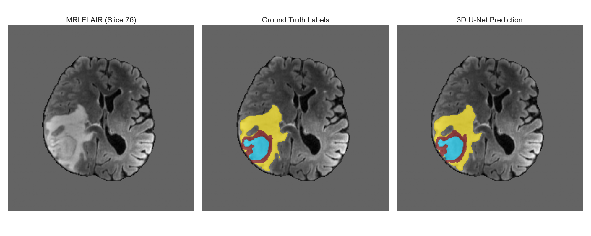

# Volumetric Segmentation of Brain Gliomas using a 3D U-Net with Self-Supervised Masked Autoencoder Pre-training.
## Overview
This repository implements a two-stage 3D brain tumor segmentation for MRI volumes:

**1) Self-supervised MAE pretraining:** a masked autoencoding task teaches the encoder anatomical priors by reconstructing masked 3D MRI patches.

**2) Supervised fine-tuning:** the pretrained encoder is transferred into a 3D U-Net for multi-class tumor segmentation.

**Summary:** This project evaluates the performance of a 3D U-Net architecture initialized with self-supervised weights from a Masked Autoencoder pre-trained on unlabelled 3D MRI volumes. The model was trained on the BraTS dataset using a hybrid Dice and Categorical Cross-Entropy loss. Evaluation on unseen test volumes demonstrated robust performance across all tumor sub-regions. The model achieved Mean Dice scores of 0.894 (WT), 0.886 (TC), and 0.858 (ET). Furthermore, the 95th percentile Hausdorff Distance (HD95) remained low at 7.64mm for the Whole Tumor, indicating high spatial precision. These results suggest that self-supervised pre-training provides significant anatomical priors that improve the delineation of complex necrotic and enhancing tumor cores in a 3D context.

## Methods
**1. Dataset and Preprocessing**

The model is trained and evaluated on the BraTS (Brain Tumor Segmentation) dataset ([here](https://www.synapse.org/Synapse:syn51156910/wiki/627000))
* **Input:** Four co-registered MRI modalities are utilized: T1-native (T1n), T1-contrast (T1c), T2-weighted (T2w), and FLAIR.
* **Normalization:** Each volume underwent independent Z-score normalization
* **Patch Extraction:** Due to memory constraints of 3D data, training relies on randomly extracted $128 \times 128 \times 128$ voxel patches. To fix the severe class imbalance of healthy vs. tumor tissue, a balanced sampling strategy is employed (tumor_prob = 0.5), forcing 50% of the training patches to center directly on a tumor lesion.

**2. Self-Supervised MAE Pre-training**

The network is fed unlabelled 3D MRI patches where a heavy mask ratio (75%) obscures the majority of the spatial information.
The autoencoder is forced to reconstruct the missing voxels.

**3. Supervised 3D U-Net**

Once the encoder understands baseline brain anatomy, its weights are transferred to a standard 3D U-Net for the downstream segmentation task.
* **Architecture:** The pre-trained MAE encoder acts as the contracting path, connected via skip connections to a randomly initialized expansive path.
* **Loss Function:** The model is optimized using a custom hybrid loss function. A multi-class Dice Loss and a Categorical Cross-Entropy Loss were used to penalize voxel-level classification errors.

**4. Inference and Evaluation**

* **Sliding-Window Inference:** Predictions are generated by chunking the full volume into $128^3$ patches and stitching them together. A stride of $64 \times 64 \times 64$ is used, creating a 50% overlap. The overlapping predictions are averaged. 

* **Hierarchical Evaluation:** The raw 4-class softmax outputs are mapped to the clinical sub-regions:

    * **Whole Tumor (WT):** All tumor classes combined.

    * **Tumor Core (TC):** Necrotic core + Enhancing tumor.

    * **Enhancing Tumor (ET):** Enhancing core only.

* **Metrics:** 

## Results

The model was evaluated on unseen test volumes from the dataset. 

The evaluation relies on the Dice Coefficient (measuring volumetric overlap) and the 95th percentile Hausdorff Distance (HD95) (measuring spatial boundary precision).

| Region | Mean Dice Score | Std Dice | Mean HD95 (mm)
| :--- | :--- | :--- | :---
| **Whole Tumor (WT)** | 0.89 | 0.118 | 7.64 
| **Tumor Core (TC)** | 0.88 | 0.18 | 11.56
| **Enhancing Tumor (ET)** | 0.85 | 0.15 | 9.84

**acknowledgement:** Data used in this project were obtained as part of the Brain Tumor Segmentation (BraTS) Challenge project through Synapse ID: syn51156910.

